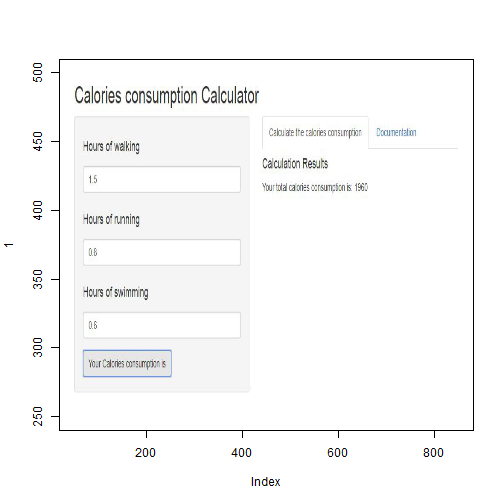

Course Project: Shiny Application and Reproducible Pitch
========================================================
author: Y.Lu
date: 2019/02/27
autosize: true

========================================================

Assignment Requirement

- Write a shiny application 
- Make a presentation

========================================================
Assignment Introduction

I normally do three sports: walking, running and swimming. This app calculates the estimated energy consumption as a result of these three sports. The calorie consumption per hour of these sports are separately about 400, 800, 1200. After filling the hours of each type of sport, the totoal energy consumption can be calculated.

========================================================
Appearance of app

========================================================
App 
The link of the app and corresponding codes can be found in: 
br()
https://github.com/Yao1987/Course9_4_1. 

